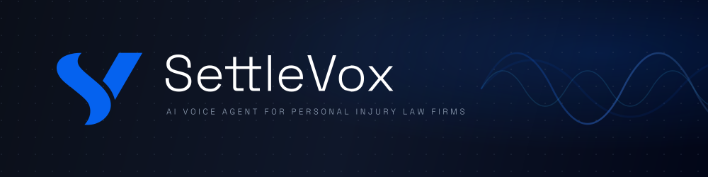
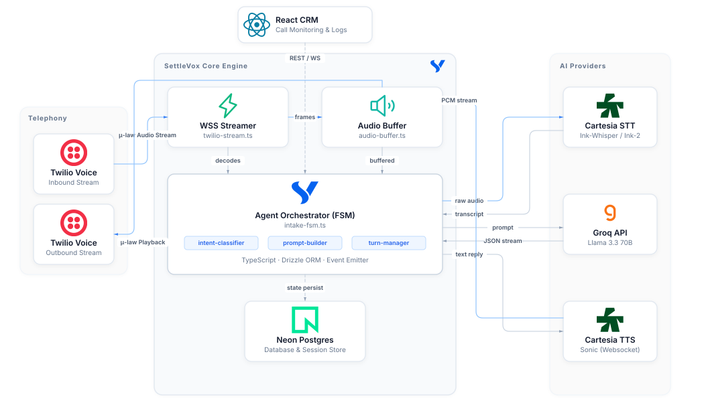

<div align="center">
  
</div>


SettleVox is an end-to-end AI voice agent designed for Personal Injury (PI) law firms. It automates the intake process by answering calls, conducting a structured legal interview, evaluating case qualification, and extracting the data directly into a structured format for case management systems.

## 🚀 Features

- **Real-Time Conversational AI**: Sub-600ms Time-to-First-Audio (TTFA) latency for natural, fluid conversations.
- **Barge-In (Interruption) Handling**: Automatically stops speaking within 250ms when a caller interrupts, flushing the audio buffer and maintaining context.
- **Agentic Finite State Machine (FSM)**: Enforces a strict 7-phase intake flow (Greeting ➔ Incident ➔ Injury ➔ Liability ➔ Insurance ➔ Qualification ➔ Wrap-up) to prevent hallucinations and strictly avoid giving legal advice.
- **Structured Extraction**: Extracts case data (incident type, injuries, liability, insurance) using Zod schemas and gracefully handles missing/refused information to prevent FSM infinite loops.
- **Analytics Dashboard**: A modern, dark-themed React SPA (using Tailwind CSS and shadcn-ui) to visualize call volume, AI summaries, transcripts, and extracted intake data.

## 🏗️ Architecture

<div align="center">
  
</div>

### The Voice Pipeline Loop
`Twilio (Raw Audio) ➔ Cartesia STT ➔ Orchestrator (Node.js) ➔ Groq Llama-3.3-70b (LLM) ➔ Cartesia TTS ➔ Twilio (Raw Audio)`

- **Telephony**: Twilio Media Streams (WebSocket).
- **Speech-to-Text (STT)**: Cartesia STT (Ink-2 AutoFinalize WebSocket).
- **Language Model (LLM)**: Groq (Llama 3.3 70B versatile).
- **Text-to-Speech (TTS)**: Cartesia Sonic (ultra-low latency).
- **Database**: Neon Postgres with Drizzle ORM for robust transcript and case data storage.

### Critical Engineering Highlights
- **Zero-Copy Audio Passthrough**: Audio is streamed in raw 8kHz G.711 μ-law end-to-end between Twilio and Cartesia. No Node.js CPU overhead is wasted decoding to PCM/WAV.
- **Greedy TTS Buffering**: Prevents the TTS engine from locking up on rapid, multi-sentence LLM chunks by processing boundaries instantly.
- **Concurrent Extraction Queue**: Locks LLM extraction tasks during rapid user turns, preventing race conditions from corrupting the FSM state or Database.

## 🛠️ Tech Stack

**Backend**
- Node.js & Express
- WebSockets (`ws`)
- `groq-sdk`
- `@cartesia/cartesia-js`
- Drizzle ORM + Neon Postgres
- Zod & Pino

**Frontend**
- React + Vite
- Tailwind CSS (v3)
- shadcn-ui
- Recharts
- Phosphor Icons

## 🏃‍♂️ Getting Started

### Prerequisites
- Node.js (v18+)
- Postgres database (e.g., Neon)
- Twilio Account (Phone Number + Webhooks configured)
- Cartesia API Key
- Groq API Key
- [ngrok](https://ngrok.com/) for exposing your local server to Twilio

### Installation

1. Clone the repository
```bash
git clone https://github.com/yourusername/settlevox.git
cd settlevox
```

2. Set up the Backend
```bash
cd backend
npm install
cp .env.example .env
# Fill in your .env variables (Twilio, Cartesia, Groq, DB URL)
npm run dev
```

3. Expose the Backend with ngrok
To allow Twilio to reach your local backend and connect to the WebSocket, use ngrok:
```bash
ngrok http 3000
```
Update your Twilio phone number webhook URL to point to `https://<your-ngrok-url>/api/voice`, and make sure `BASE_URL` in your `.env` points to the ngrok URL so Twilio Media Streams connect successfully.

4. Set up the Frontend
```bash
cd ../frontend
npm install
npm run dev
```

## 📜 License
MIT License. See `LICENSE` for more information.
